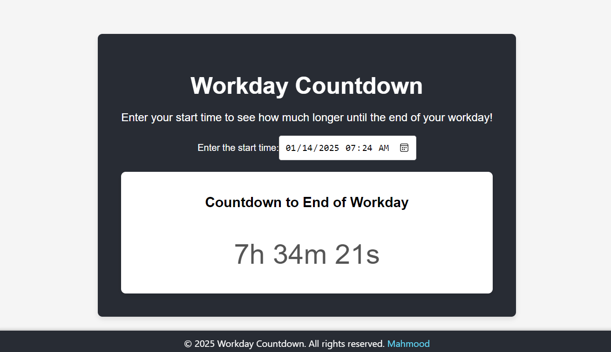

# Workday Countdown

Workday Countdown is a simple React application that allows users to enter their start time and choose the duration of their workday. It then provides a countdown to the end of their workday and displays the exact end time.

## Features

- Enter your start time using a datetime input.
- Select the workday duration (8 hours or 8.5 hours).
- Countdown timer displaying the remaining time until the end of the workday.
- Displays the exact end time of the workday.
- Responsive design for both desktop and mobile devices.

## Contributing

If you'd like to contribute to this project, please feel free to fork the repository and submit a pull request.

## License

This project is licensed under the MIT License.

## Screenshots

